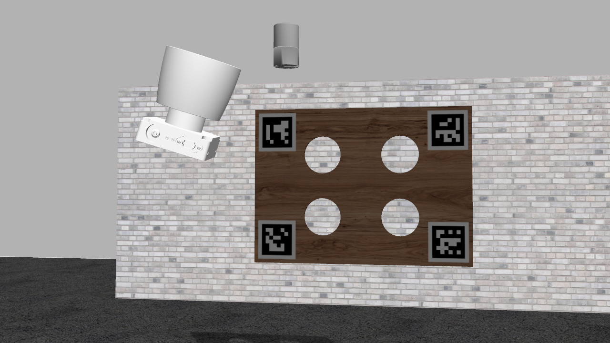

# velo2cam_gazebo
Repository including Gazebo models, plugins and worlds to test algorithms for extrinsic calibration of pair of sensors composed of LiDAR and camera devices in any possible combination, as described in this paper:

**Automatic Extrinsic Calibration Method for LiDAR and Camera Sensor Setups**  
[Jorge Beltrán](https://beltransen.github.io/), [Carlos Guindel](https://cguindel.github.io/), Arturo de la Escalera, Fernando García  
IEEE Transactions on Intelligent Transportation Systems, 2022  
**\[[Paper](https://ieeexplore.ieee.org/abstract/document/9733276)\] \[[Preprint](https://arxiv.org/abs/2101.04431)\]**



## Gazebo models
This repository includes several sensors and calibration target models to evaluate the performance of extrinsic calibration of lidar-camera pair in the Gazebo Simulator. The models need to be moved to ~/.gazebo/models/ if you want access them from Gazebo.

Note: The models included in this repository were designed for evaluating the LIDAR-camera calibration algorithms described in [1] and [2], whose code is provided [here](https://github.com/beltransen/velo2cam_calibration).

Sensors:

* Monocular cameras: FLIR Blackfly S 31S4C-C
* Stero cameras: FLIR Bumblebee XB3 Camera (Left - center only)
* LiDARs: Velodyne VLP-16, Velodyne HDL-32, Velodyne HDL-64

Calibration targets:

* Different calibration target embodiments.
* Some checkerboard planes for recreating worlds required to test the [KIT Calibration Toolbox](http://www.cvlibs.net/software/calibration/) and [Matlab Calibration Toolbox](https://es.mathworks.com/help/lidar/ug/lidarcameracalibrationexample.html).

## Gazebo plugins
* Velodyne plugin providing PointCloud2 with same structure as driver (x, y, z, intensity, ring) and simulated Gaussian noise. (Code from [DataspeedInc](https://bitbucket.org/DataspeedInc/velodyne_simulator), although minor patch for vertical resolution issue is included)

## Known Issues
* Gazebo can take up to 30 seconds to load the VLP-16 pluggin, 60 seconds for the HDL-32E, and much more HDL-64E
* Gazebo cannot maintain 10Hz with large pointclouds
    * Solution: User can reduce number of points in urdf

## Gazebo Calibration Scenarios
* Launch files for all calibrations scenarios used in the related published manuscripts are included. To launch a sample scenario, run:
	```roslaunch velo2cam_gazebo mono_hdl64_p1_real.launch```

## Citation ##
If you use this work in your research, please consider citing the following paper:

```
@article{beltran2022,  
  author={Beltrán, Jorge and Guindel, Carlos and de la Escalera, Arturo and García, Fernando},  
  journal={IEEE Transactions on Intelligent Transportation Systems},   
  title={Automatic Extrinsic Calibration Method for LiDAR and Camera Sensor Setups},   
  year={2022}, 
  doi={10.1109/TITS.2022.3155228}
}
```

A previous version of this tool is available [here](https://github.com/beltransen/velo2cam_calibration/tree/v1.0) and was described on this [paper](https://doi.org/10.1109/ITSC.2017.8317829). 
